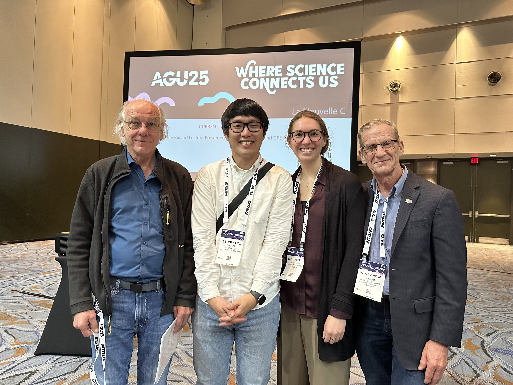
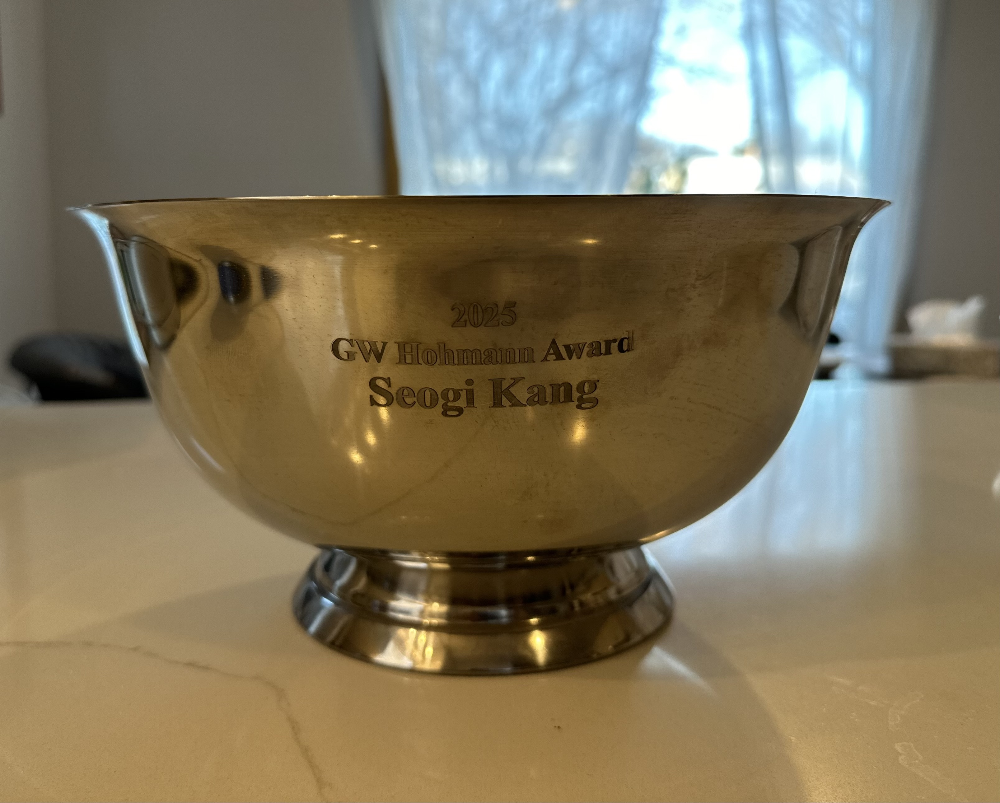

I am honored to have received the **Gerald Hohmann Award**, presented during the **Geomagnetism, Paleomagnetism, and Electromagnetism (GPE)** session event at the most recent **AGU Fall Meeting**.

The Gerald Hohmann Award recognizes excellence in **electromagnetic (EM) geophysics** and is sponsored by the **G.W. Hohmann Trust**. Recipients are nominated by the global geophysics community and selected by the Hohmann Trustees, making this recognition particularly meaningful.

The award is named in honor of **Gerald W. Hohmann**, a pioneer whose work fundamentally shaped modern electromagnetic theory and practice in geophysics. His contributions continue to influence how EM data are modeled, interpreted, and applied across a wide range of subsurface problems.

During the award event, I was fortunate to share the moment with colleagues and mentors who have played an important role in my professional development. One of the photos from the event includes Steve Constable, Lindsey Heagy, and Douglas Oldenburg. Steve Constable and Lindsey Heagy serve on the award committee, and Douglas Oldenburg kindly wrote the nomination letter in support of this award. Another photo shows the commemorative bowl that accompanies the award.

On a personal note, this recognition is especially meaningful to me as an electromagnetic geophysicist. Gerald Hohmann was a co-editor of a foundational textbook that I relied on heavily at the very beginning of my academic career:

> Ward, S. H., and G. W. Hohmann (1988),  
> *Electromagnetic Theory for Geophysical Applications*,  
> Chapter 4 of *Electromagnetic Methods in Applied Geophysics*,  
> SEG, Investigations in Geophysics No. 3.

As I continue my work at the University of Manitoba, this award is both an encouragement and a motivation to further advance electromagnetic geophysics through methodological development, open-source software, and interdisciplinary applications related to groundwater, mineral resources, and environmental systems.

I am deeply grateful to my mentors, collaborators, students, and the broader EM geophysics community for their support and inspiration.

